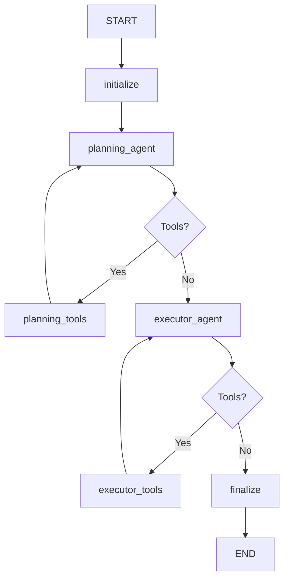

# Auxilium Agent System - Complete Technical Documentation

## Table of Contents
1. [System Overview](#system-overview)
2. [Architecture](#architecture)
3. [LangGraph Workflow](#langgraph-workflow)
4. [State Management](#state-management)
5. [Agent Roles](#agent-roles)
6. [Tools System](#tools-system)
7. [Memory System](#memory-system)
8. [Message Flow](#message-flow)
9. [Configuration](#configuration)
10. [Implementation Details](#implementation-details)

---

## System Overview

Auxilium is a **sophisticated multi-agent system** built with LangGraph that acts as a personal productivity assistant. The system uses **two specialized agents** working in sequence to analyze user requests and execute comprehensive actions.

### Core Concept
- **Planning Agent**: Strategic analysis and recommendation generation
- **Executor Agent**: Precise execution of planned actions
- **Memory System**: Multi-turn conversation support with exchange summaries
- **Tool Ecosystem**: Comprehensive CRUD operations for objectives, gamification, and memory

### Key Features
- **Multi-turn conversations** with memory persistence
- **Hierarchical objective management** with unlimited nesting depth
- **Gamification system** with points, achievements, and streaks
- **Thinking-enabled LLMs** for enhanced reasoning
- **JSON serialization safety** for complex data types
- **Comprehensive error handling** and iteration limits

---

## Architecture

### High-Level Flow
```
User Input → Initialize → Planning Agent ↔ Planning Tools → Executor Agent ↔ Executor Tools → Finalize → User Response
                   ↓                ↓                        ↓                ↓
              Start Exchange    Tool Execution        Tool Execution    Extract Response
                   ↓                ↓                        ↓                ↓
              Memory System    Update Planning      Update Executor    Save Summaries
                              Conversation         Conversation
```

### Components

#### 1. **AgentGraph** (`agents/agent_graph.py`)
- **Main orchestrator** that builds and manages the LangGraph workflow
- **Quota management** for API rate limiting
- **Model initialization** with Google Gemini 2.5 Flash
- **Node and edge definitions** for the workflow

#### 2. **Memory System** (`agents/memory_system.py`)
- **Thread-based conversation storage**
- **Exchange summary management**
- **LangGraph checkpointer integration**
- **User context and memory retrieval**

#### 3. **Tools** (`agents/tools/`)
- **Objective Tools**: CRUD operations for objectives and tasks
- **Memory Tools**: User fact storage and retrieval
- **Gamification Tools**: Points, achievements, streak management
- **Utility Tools**: Time, planning, and response tools

#### 4. **Prompts** (`agents/prompts/`)
- **Planning Agent Prompt**: Strategic analysis instructions
- **Executor Agent Prompt**: Execution guidelines and tool usage

---

## LangGraph Workflow

### Workflow Graph Structure


### Node Descriptions

#### 1. **Initialize Node** (`_initialize_node`)
**Purpose**: Set up the workflow state and start a new exchange

**Process**:
```python
# Extract user input from incoming message
user_input = last_message.content

# Create new exchange in memory system
exchange_id = await self.memory_system.start_new_exchange(thread_id, user_input)

# Get conversation history for planning agent
conversation_history = await self.memory_system.get_context_for_planner(thread_id)

# Initialize state
return {
    "user_input": user_input,
    "user_memories": user_context["user_memories"],
    "current_agent": "planning",
    "iteration_count": 0,
    "thread_id": thread_id,
    "exchange_id": exchange_id,
    "conversation_history": conversation_history,
    "planning_conversation": [],
    "executor_conversation": []
}
```

**State Updates**:
- Sets `user_input`, `user_memories`, `thread_id`, `exchange_id`
- Initializes empty conversation arrays
- Loads conversation history for planning context

#### 2. **Planning Agent Node** (`_planning_agent_node`)
**Purpose**: Strategic analysis and recommendation generation

**Message Structure**:
```python
# System Message (Instructions only)
system_message = SystemMessage(content=PLANNING_AGENT_PROMPT.format(
    current_date=user_context["formatted_date"],
    user_memories=state["user_memories"]
))

# User Message (Content to process)
if not planning_conv:
    # First iteration: user input + conversation history
    user_message_content = state["user_input"]
    if conversation_context:
        user_message_content += f"\n\nPrevious conversation history:\n{conversation_context}"
else:
    # Subsequent iterations: continue analyzing
    user_message = HumanMessage(content=f"Continue analyzing: {state['user_input']}")
    # Add planning conversation history
    messages.extend(planning_conv)
```

**Process**:
1. **Format prompt** with current date and user memories
2. **Build message sequence** with proper conversation history
3. **Call planning LLM** with tools bound
4. **Update planning conversation** with new response
5. **Increment iteration count**

**State Updates**:
- Appends to `planning_conversation`
- Updates `iteration_count`
- Sets `current_agent` to "planning"

#### 3. **Planning Tools Node** (`_create_tool_node(ALL_PLANNING_TOOLS)`)
**Purpose**: Execute tools requested by planning agent

**Available Tools**:
- `retrieve_objective_by_id`: Get specific objectives
- `retrieve_objective_by_name`: Search by name
- `retrieve_full_objective_tree`: Get complete hierarchies
- `retrieve_objectives_by_time_period`: Time-based retrieval
- `retrieve_all_objectives`: Full system overview
- `save_user_memory`: Record user insights
- `final_response`: Complete planning analysis

**Process**:
1. **Extract tool calls** from last AI message
2. **Execute each tool** with provided arguments
3. **Handle summary extraction** from `final_response` tool
4. **Create ToolMessage** objects with results
5. **Update conversation history**

**Summary Capture**:
```python
if tool_name == 'final_response' and state.get("current_agent") == "planning":
    summary = tool_args.get('summary', '')
    await self.memory_system.update_planner_summary(
        state["thread_id"], 
        state["exchange_id"], 
        summary
    )
```

#### 4. **Executor Agent Node** (`_executor_agent_node`)
**Purpose**: Execute planning recommendations with precision

**Message Structure**:
```python
# System Message (Instructions only)
system_message = SystemMessage(content=EXECUTOR_AGENT_PROMPT.format(
    current_date=user_context["formatted_date"],
    user_memories=state["user_memories"]
))

# User Message (User input + planning analysis)
if not executor_conv:
    # First iteration
    user_message_content = f"Original user request: {state['user_input']}\n\nPlanning analysis from the Planning Agent:\n{planning_analysis}"
else:
    # Subsequent iterations
    context_message = HumanMessage(content=f"Continue execution for: {state['user_input']}")
    # Add executor conversation history
    messages.extend(executor_conv)
```

**Planning Analysis Extraction**:
```python
# Extract from planning conversation
for msg in state.get("planning_conversation", []):
    if hasattr(msg, 'content') and isinstance(msg, AIMessage):
        content = msg.content
        if isinstance(content, list):
            content = "\n".join(str(item) for item in content)
        planning_analysis += content + "\n\n"
```

**State Updates**:
- Appends to `executor_conversation`
- Updates `iteration_count`
- Sets `current_agent` to "executor"
- Updates `planning_analysis`

#### 5. **Executor Tools Node** (`_create_tool_node(ALL_EXECUTOR_TOOLS)`)
**Purpose**: Execute actions requested by executor agent

**Available Tools**:
- `create_objective`: Create new objectives/tasks
- `update_objective`: Modify existing objectives
- `delete_objective`: Cascading delete operations
- `retrieve_objective_by_id`: Get context for linking
- `retrieve_objectives_by_time_period`: Check conflicts
- `move_objective_parent`: Reorganize hierarchies
- `get_gamification_stats`: Check user stats
- `update_gamification_stats`: Award points/achievements
- `save_user_memory`: Record extraordinary events
- `plan`: Create execution strategy
- `final_response_to_user`: Complete interaction

**Summary Capture**:
```python
elif tool_name == 'final_response_to_user' and state.get("current_agent") == "executor":
    summary = tool_args.get('action_summary', '')
    await self.memory_system.update_executor_summary(
        state["thread_id"], 
        state["exchange_id"], 
        summary
    )
```

#### 6. **Finalize Node** (`_finalize_node`)
**Purpose**: Extract final response and complete workflow

**Response Extraction**:
```python
# Look for final_response_to_user tool results
executor_conv = state.get("executor_conversation", [])
for msg in reversed(executor_conv):
    if "final_response_to_user" in content and "response_content" in content:
        # Parse JSON response
        response_data = json.loads(json_match.group())
        final_response = response_data.get("response_content", "")
```

**State Updates**:
- Sets `final_response` (what user receives)
- Sets `current_agent` to "completed"

### Conditional Logic

#### Planning Tools Decision (`_should_use_planning_tools`)
**Logic**:
1. **Too many iterations** (≥6) → Move to executor
2. **`final_response` tool called** → Move to executor
3. **Other tool calls present** → Execute tools
4. **Content-only response + insufficient research** → Continue planning
5. **Default** → Continue planning

#### Executor Tools Decision (`_should_use_executor_tools`)
**Logic**:
1. **Max iterations reached** → Finish
2. **Error detected** → Finish
3. **`final_response_to_user` called** → Finish
4. **Plan tool called 3+ times** → Finish (loop prevention)
5. **40+ action tools executed** → Finish (comprehensive work done)
6. **Action tools present** → Execute tools
7. **Default** → Execute tools

---

## State Management

### AgentState Structure

```python
class AgentState(MessagesState):
    # Core LangChain messaging
    messages: List[BaseMessage] = []  # Current node messages
    
    # Content & Analysis
    user_input: str = ""              # Original user request
    planning_analysis: str = ""       # Extracted planning analysis
    conversation_history: str = ""    # Formatted past exchanges
    final_response: str = ""          # Response to user
    
    # Memory & Context
    user_memories: str = ""           # User facts/preferences
    thread_id: str = ""              # Thread identifier
    exchange_id: str = ""            # Current exchange ID
    
    # Workflow Control
    current_agent: str = ""          # "planning" or "executor"
    iteration_count: int = 0         # Safety counter
    
    # Conversation Storage
    planning_conversation: List = [] # Complete planning flow
    executor_conversation: List = [] # Complete executor flow
    
    # Legacy (unused)
    planner_summary: str = ""       # Not actively used
    executor_summary: str = ""      # Not actively used
```

### State Update Patterns

#### Messages Flow
- **`messages`**: Always contains current node's messages
- **`planning_conversation`**: Accumulates ALL planning messages
- **`executor_conversation`**: Accumulates ALL executor messages

#### Agent Separation
- **Planning agent receives**: `user_input` + `conversation_history`
- **Executor agent receives**: `user_input` + `planning_analysis`

#### Iteration Tracking
- **`iteration_count`**: Global counter across agents
- **`len(planning_conversation)`**: Planning-specific iterations
- **`len(executor_conversation)`**: Executor-specific iterations

---

## Agent Roles

### Planning Agent

**Role**: Strategic analyst and recommendation generator

**Responsibilities**:
1. **Analyze user requests** with full context
2. **Research existing objectives** to avoid conflicts
3. **Generate strategic recommendations** for execution
4. **Assess workload and burnout risk**
5. **Provide detailed analysis** for executor

**Tools Available**:
- All **retrieval tools** for context gathering
- **`save_user_memory`** for learning about user
- **`final_response`** to complete analysis

**Prompt Key Points**:
- **Superhuman mindset** - think 10 steps ahead
- **Proactive anticipation** of user needs
- **Comprehensive research** before recommendations
- **Strategic analysis** with specific IDs, dates, metadata

**Output**: Detailed analysis with strategic recommendations passed to executor

### Executor Agent

**Role**: Precision execution engine

**Responsibilities**:
1. **Follow planning recommendations exactly**
2. **Execute appropriate actions** based on scope
3. **Create/modify/delete objectives** as needed
4. **Manage gamification** appropriately
5. **Provide final response** to user

**Tools Available**:
- All **CRUD tools** for objectives
- **Gamification tools** for user engagement
- **`plan`** tool for strategy creation
- **`final_response_to_user`** to complete interaction

**Prompt Key Points**:
- **Strategic execution engine** following planner's vision
- **Scale actions to match planned scope**
- **Comprehensive field completion** for all objectives
- **Hierarchical structure** management

**Output**: User-facing response and action summary for memory

---

## Tools System

### Objective Tools (`agents/tools/objective_tools.py`)

#### Core Data Structures
```python
class ObjectiveCreate(BaseModel):
    # Basic fields
    title: str
    description: Optional[str]
    objective_type: ObjectiveType  # main_objective, sub_objective, task, habit
    parent_id: Optional[str]
    
    # Scheduling
    start_date: Optional[str]      # ISO format
    due_date: Optional[str]        # ISO format
    all_day: bool = True
    
    # Prioritization
    priority_score: float = 0.5    # 0.0-1.0
    complexity_score: float = 0.5  # 0.0-1.0
    energy_requirement: EnergyLevel # low, medium, high
    
    # Status & Progress
    status: ObjectiveStatus = "not_started"
    context_tags: List[str] = []
    success_criteria: List[str] = []
    dependencies: List[str] = []
    
    # Gamification
    points_awarded_for_completion: int = 10
    
    # Task-specific (when objective_type="task")
    start_time: Optional[str]
    end_time: Optional[str]
    location: Optional[str]
    estimated_duration_minutes: Optional[int]
    actionable_steps: List[str] = []
    
    # Recurring patterns
    recurring: Optional[Dict[str, Any]]
```

#### Tools Breakdown

##### `retrieve_objective_by_id(objective_id: str, with_children: bool = False)`
**Purpose**: Get specific objective by UUID

**Process**:
1. **Query repository** with UUID
2. **Check if exists**, return error if not found
3. **Optionally include children** if `with_children=True`
4. **Return JSON** with objective details

**Use Cases**: Getting context, verifying existence, building hierarchies

##### `retrieve_objective_by_name(name: str)`
**Purpose**: Fuzzy search for objectives by title

**Process**:
1. **Load all objectives** from repository
2. **Perform text matching** on titles and descriptions
3. **Score relevance** (exact match=1.0, partial=0.8, description=0.6)
4. **Return top 3 matches** sorted by score

**Use Cases**: Finding related objectives, avoiding duplicates

##### `retrieve_full_objective_tree(objective_id: str)`
**Purpose**: Get complete hierarchy starting from root

**Process**:
1. **Get root objective** by ID
2. **Recursively build tree** of all children
3. **Maintain parent-child relationships**
4. **Return nested structure**

**Use Cases**: Understanding full scope, planning reorganization

##### `retrieve_objectives_by_time_period(start_date: str, end_date: str)`
**Purpose**: Get all objectives within date range

**Process**:
1. **Parse ISO date strings** to datetime objects
2. **Filter objectives** where dates overlap with range
3. **Include created_at** as fallback for start_date
4. **Return matching objectives** with metadata

**Use Cases**: Schedule analysis, conflict detection, workload assessment

##### `retrieve_all_objectives()`
**Purpose**: Get complete system overview

**Process**:
1. **Load all objectives** from repository
2. **Generate summary statistics** by type, status, priority
3. **Return comprehensive data** with counts

**Use Cases**: System overview, statistics, comprehensive analysis

##### `create_objective(objective_data: str)`
**Purpose**: Create new objectives or tasks with full metadata

**Process**:
1. **Parse JSON data** with schema validation
2. **Handle recurring patterns** (nested and flat formats)
3. **Convert dependencies** to UUIDs
4. **Determine type** (task vs objective)
5. **Create with repository** and return result

**JSON Serialization Handling**:
```python
# Custom serializer for complex types
def custom_json_serializer(obj):
    if isinstance(obj, timedelta):
        return obj.total_seconds()  # Convert to seconds
    elif isinstance(obj, datetime):
        return obj.isoformat()
    elif isinstance(obj, UUID):
        return str(obj)
    # ... additional types
```

**Task-Specific Logic**:
```python
if data.get("objective_type") == "task":
    task_fields.update({
        "estimated_duration": timedelta(minutes=data["estimated_duration_minutes"]),
        "start_time": datetime.fromisoformat(data["start_time"]),
        "end_time": datetime.fromisoformat(data["end_time"]),
        "location": data.get("location"),
        "actionable_steps": data.get("actionable_steps", [])
    })
    created = await repo.create(Task(**task_fields))
```

##### `delete_objective(objective_id: str)`
**Purpose**: Cascading delete of objective and ALL children

**Process**:
1. **Verify objective exists**
2. **Find all children recursively**
3. **Delete in order**: children first, then parent
4. **Track deletion count** and titles
5. **Return comprehensive summary**

**⚠️ Warning**: This is a **CASCADING DELETE** - it removes the objective and ALL descendants!

##### `move_objective_parent(objective_id: str, new_parent_id: Optional[str])`
**Purpose**: Move objective and all children to new parent

**Process**:
1. **Verify objective and new parent exist**
2. **Calculate new degree levels** for hierarchy
3. **Move target objective** to new parent
4. **Recursively update all children** with new degrees
5. **Maintain complete subtree** integrity

### Memory Tools (`agents/tools/memory_tools.py`)

#### `save_user_memory(memory_text: str, category: str = "general")`
**Purpose**: Store important user insights for future context

**Process**:
1. **Load existing memory data** from JSON file
2. **Create memory entry** with timestamp and ID
3. **Append to user_memories** array
4. **Save updated data** with safe JSON serialization

**Categories**: preferences, patterns, goals, constraints

#### `get_user_memories(category: str = None, limit: int = 20)`
**Purpose**: Retrieve user memories for context

**Process**:
1. **Load memory data** from file
2. **Filter by category** if specified
3. **Sort by timestamp** (most recent first)
4. **Limit results** to specified count

### Gamification Tools (`agents/tools/gamification_tools.py`)

#### `get_gamification_stats()`
**Purpose**: Get current user stats

**Returns**:
- `overall_score`: Total points earned
- `current_streak_days`: Consecutive active days
- `achievements`: Unlocked achievements with timestamps
- `total_achievements`: Count of unlocked vs available

#### `update_gamification_stats(stat_type: str, value: int, reason: str = "")`
**Purpose**: Update user gamification data

**Types**:
- **"points"**: Add points to overall score
- **"streak"**: Set streak days
- **"reset_streak"**: Reset streak to 0

**Process**:
1. **Get user profile** from repository
2. **Apply update** based on type
3. **Log change** with reason
4. **Return summary** of changes

### Utility Tools (`agents/tools/utility_tools.py`)

#### `get_current_time()`
**Purpose**: Provide current date/time information

**Returns**: Comprehensive time data with UTC and local times

#### `plan(plan_details: str)`
**Purpose**: Executor's first tool - create action strategy

**Process**: Logs plan creation and returns "Continue" to proceed

#### `final_response(analysis: str, summary: str)`
**Purpose**: Planning agent completion tool

**Parameters**:
- **`analysis`**: Detailed analysis for executor
- **`summary`**: Brief summary for memory storage

#### `final_response_to_user(response_content: str, action_summary: str = "")`
**Purpose**: Executor completion tool

**Parameters**:
- **`response_content`**: User-facing response message
- **`action_summary`**: Detailed summary for memory storage

---

## Memory System

### Architecture

#### Exchange-Based Storage
```python
class ExchangeSummary:
    user_message: str        # Original user input
    planner_summary: str     # Strategic analysis summary
    executor_summary: str    # Action summary
    timestamp: str          # ISO timestamp
    id: str                 # Unique exchange ID
```

#### Thread Management
```python
class ConversationHistory:
    thread_id: str                        # Thread identifier
    exchanges: List[ExchangeSummary]      # Exchange list
    created_at: str                       # Thread creation time
    last_updated: str                     # Last modification time
```

### File Storage Structure
**Location**: `data/conversation_history.json`

```json
{
  "thread_uuid_123": {
    "thread_id": "thread_uuid_123",
    "created_at": "2025-07-03T10:00:00",
    "last_updated": "2025-07-03T14:30:00",
    "exchanges": [
      {
        "id": "exchange_uuid_456",
        "user_message": "Help me learn Python programming",
        "planner_summary": "Analyzed request for Python learning. Created comprehensive 6-month curriculum...",
        "executor_summary": "Created 12 learning objectives with practical projects...",
        "timestamp": "2025-07-03T10:00:00"
      }
    ]
  }
}
```

### Memory Operations

#### Starting New Exchange
```python
async def start_new_exchange(self, thread_id: str, user_message: str) -> str:
    # Get or create conversation history
    history = await self.get_conversation_history(thread_id)
    
    # Add new exchange
    exchange = history.add_exchange(user_message)
    
    # Save to file
    await self.save_conversation_history(history)
    
    return exchange.id
```

#### Updating Summaries
```python
# From tool execution
if tool_name == 'final_response':
    summary = tool_args.get('summary', '')
    await self.memory_system.update_planner_summary(
        thread_id, exchange_id, summary
    )
```

#### Context for Planning Agent
```python
def get_formatted_history_for_planner(self) -> str:
    recent_exchanges = self.get_last_10_exchanges()
    
    formatted_history = []
    for exchange in recent_exchanges:
        formatted_history.append(f"User: {exchange.user_message}")
        if exchange.planner_summary:
            formatted_history.append(f"Planner: {exchange.planner_summary}")
        if exchange.executor_summary:
            formatted_history.append(f"Executor: {exchange.executor_summary}")
        formatted_history.append("---")
    
    return "\n".join(formatted_history)
```

### LangGraph Integration
The memory system integrates with LangGraph's checkpointer for state persistence:

```python
# Compile graph with memory
return workflow.compile(
    checkpointer=self.memory_system.get_checkpointer(),
    recursion_limit=500
)
```

---

## Message Flow

### Complete Message Journey

#### 1. **User Input Processing**
```python
# Initial state
initial_state = {
    "messages": [HumanMessage(content=user_input)],
    "thread_id": thread_id
}
```

#### 2. **Initialize Node**
```python
# Extract user input
user_input = last_message.content

# Start exchange
exchange_id = await memory_system.start_new_exchange(thread_id, user_input)

# Load conversation history
conversation_history = await memory_system.get_context_for_planner(thread_id)
```

#### 3. **Planning Agent Messages**
```python
# System message (instructions only)
system_message = SystemMessage(content=PLANNING_AGENT_PROMPT.format(...))

# User message (content + history)
user_message_content = user_input
if conversation_history:
    user_message_content += f"\n\nPrevious conversation history:\n{conversation_history}"

messages = [system_message, HumanMessage(content=user_message_content)]
```

#### 4. **Planning Conversation Flow**
```python
# Planning agent iterations
planning_conversation = [
    AIMessage(content="I need to analyze..."),                    # Analysis
    AIMessage(content="", tool_calls=[{retrieve_objectives...}]), # Tool call
    ToolMessage(content="...", name="retrieve_objectives..."),    # Tool result
    AIMessage(content="Based on analysis..."),                    # More analysis
    AIMessage(content="", tool_calls=[{final_response...}]),      # Completion
    ToolMessage(content="...", name="final_response")             # Completion result
]
```

#### 5. **Executor Agent Messages**
```python
# System message (instructions only)
system_message = SystemMessage(content=EXECUTOR_AGENT_PROMPT.format(...))

# User message (user input + planning analysis)
user_message_content = f"Original user request: {user_input}\n\nPlanning analysis from the Planning Agent:\n{planning_analysis}"

messages = [system_message, HumanMessage(content=user_message_content)]
```

#### 6. **Executor Conversation Flow**
```python
# Executor agent iterations
executor_conversation = [
    AIMessage(content="", tool_calls=[{plan...}]),                # Strategy
    ToolMessage(content="Continue", name="plan"),                 # Strategy result
    AIMessage(content="", tool_calls=[{create_objective...}]),    # Action
    ToolMessage(content="...", name="create_objective"),          # Action result
    # ... more actions ...
    AIMessage(content="", tool_calls=[{final_response_to_user...}]), # Completion
    ToolMessage(content="...", name="final_response_to_user")       # User response
]
```

#### 7. **Final Response Extraction**
```python
# Extract from executor conversation
for msg in reversed(executor_conv):
    if "final_response_to_user" in content:
        response_data = json.loads(content)
        final_response = response_data.get("response_content", "")
```

### Message Types Explained

#### **SystemMessage**
- **Purpose**: Agent instructions and configuration
- **Contains**: Prompts, current date, user memories
- **Never contains**: User input or conversation content

#### **HumanMessage**  
- **Purpose**: Content for the agent to process
- **Planning agent**: User input + conversation history
- **Executor agent**: User input + planning analysis

#### **AIMessage**
- **Purpose**: Agent responses and tool calls
- **Content**: Analysis, reasoning, or empty (for tool calls only)
- **Tool calls**: Structured function calls with arguments

#### **ToolMessage**
- **Purpose**: Tool execution results
- **Content**: JSON responses from tool functions
- **Metadata**: Tool name and call ID for correlation

---

## Configuration

### Model Configuration (`core/config.py`)
```python
# LLM Settings
llm_temperature: float = 0.3         # Response randomness
llm_max_output_tokens: int = 8192    # Maximum response length
llm_top_p: float = 0.8              # Nucleus sampling
llm_top_k: int = 40                 # Top-k sampling

# Agent Settings
max_agent_iterations: int = 50       # Safety limit
max_research_loops: int = 10         # Planning research limit

# API Settings
google_api_key: str                  # Gemini API key
request_timeout: int = 300           # Request timeout (seconds)
retry_attempts: int = 3              # Retry count for failures

# Model Selection
planning_model: str = "gemini-2.5-flash"
executor_model: str = "gemini-2.5-flash"
enable_thinking_mode: bool = True    # Enable thinking capabilities
```

### LLM Initialization
```python
# Planning LLM
self.planning_llm = ChatGoogleGenerativeAI(
    model="gemini-2.5-flash",
    api_key=settings.google_api_key,
    temperature=settings.llm_temperature,
    max_output_tokens=settings.llm_max_output_tokens,
    top_p=settings.llm_top_p,
    top_k=settings.llm_top_k,
    max_retries=settings.retry_attempts,
    timeout=settings.request_timeout
)

# Executor LLM (slightly higher temperature for creativity)
self.executor_llm = ChatGoogleGenerativeAI(
    model="gemini-2.5-flash",
    temperature=settings.llm_temperature + 0.1,
    # ... other settings same as planning
)
```

### Graph Compilation
```python
return workflow.compile(
    checkpointer=self.memory_system.get_checkpointer(),  # Memory persistence
    recursion_limit=500  # Allow complex workflows
)
```

---

## Implementation Details

### Error Handling

#### Quota Management
```python
class QuotaManager:
    def __init__(self):
        self.last_request_time = 0
        self.min_interval = 2.0  # 2 seconds between requests
    
    async def check_quota(self):
        current_time = time.time()
        elapsed = current_time - self.last_request_time
        
        if elapsed < self.min_interval:
            wait_time = self.min_interval - elapsed
            await asyncio.sleep(wait_time)
        
        self.last_request_time = time.time()
```

#### Tool Execution Safety
```python
try:
    result = await tool_map[tool_name].ainvoke(tool_args)
    tool_message = ToolMessage(content=str(result), name=tool_name, tool_call_id=tool_id)
except Exception as e:
    error_message = ToolMessage(
        content=f"Error executing {tool_name}: {str(e)}",
        name=tool_name,
        tool_call_id=tool_id
    )
```

#### Iteration Limits
```python
# Planning phase safety
if len(planning_conv) >= 6:
    return "executor"  # Move to execution

# Executor phase safety  
if iteration_count >= settings.max_agent_iterations:
    return "finish"  # Complete workflow

# Action count limits
if action_count >= 40:
    return "finish"  # Prevent excessive work
```

### JSON Serialization

#### Custom Serializer
```python
def custom_json_serializer(obj):
    if isinstance(obj, timedelta):
        return obj.total_seconds()  # Convert to seconds
    elif isinstance(obj, datetime):
        return obj.isoformat()      # ISO string format
    elif isinstance(obj, UUID):
        return str(obj)             # String representation
    elif hasattr(obj, '__dict__'):
        return obj.__dict__         # Object dictionary
    else:
        return str(obj)             # Fallback to string
```

#### Safe JSON Wrapper
```python
def safe_json_dumps(obj, **kwargs):
    return json.dumps(obj, default=custom_json_serializer, **kwargs)
```

### Performance Optimizations

#### Parallel Tool Calls
Tools are designed to be called in parallel when possible, reducing total execution time.

#### Conversation State Management
```python
# Separate conversation histories prevent state pollution
"planning_conversation": [],  # Planning agent flow
"executor_conversation": []   # Executor agent flow
```

#### Memory Efficiency
```python
# Only last 10 exchanges loaded for context
def get_last_10_exchanges(self) -> List[ExchangeSummary]:
    return self.exchanges[-10:] if len(self.exchanges) > 10 else self.exchanges
```

### Thinking Mode Integration

The system supports Google Gemini's thinking capabilities for enhanced reasoning:

#### Thinking Content Extraction
```python
def _print_message(self, message, agent_name=""):
    # Multiple methods to extract thinking content
    thinking_content = None
    
    # Method 1: Response metadata
    if hasattr(message, 'response_metadata'):
        thinking_content = metadata.get('thinking', metadata.get('reasoning'))
    
    # Method 2: Usage metadata
    if hasattr(message, 'usage_metadata'):
        thinking_tokens = usage.get('reasoning_tokens', 0)
    
    # Method 3: Content structure
    if isinstance(content, list):
        for item in content:
            if item.get("type") in ["thinking", "reasoning"]:
                thinking_content = item.get('content')
```

---

## Usage Examples

### Basic Usage
```python
# Initialize agent
agent = AgentGraph()

# Process user input
response = await agent.process_user_input(
    "Help me learn Python programming", 
    thread_id=None  # Creates new thread
)

print(response)  # User-facing response
```

### Multi-turn Conversation
```python
# First interaction
response1 = await agent.process_user_input(
    "Help me learn Python", 
    thread_id=None
)
thread_id = agent.memory_system.current_thread_id

# Continued conversation
response2 = await agent.process_user_input(
    "I want to focus on web development",
    thread_id=thread_id  # Continue same thread
)
```

### Direct Tool Usage
```python
from agents.tools.objective_tools import create_objective

# Create objective directly
objective_data = {
    "title": "Learn Python Basics",
    "objective_type": "sub_objective",
    "start_date": "2025-07-15T09:00:00Z",
    "due_date": "2025-08-15T17:00:00Z",
    "priority_score": 0.8,
    "complexity_score": 0.6
}

result = await create_objective(json.dumps(objective_data))
```

### Memory Management
```python
# Save user insight
await save_user_memory(
    "User prefers morning learning sessions",
    category="preferences"
)

# Retrieve memories
memories = await get_user_memories(category="preferences", limit=10)
```

---

## Debugging and Monitoring

### Logging
The system uses comprehensive logging throughout:

```python
logger.info(f"🧠 Planning Agent iteration {iteration_count} completed")
logger.info(f"⚡ Executor Agent processing planning analysis...")
logger.info(f"🔧 Executed tool {tool_name} successfully")
logger.warning(f"⚠️ Max iterations reached, finishing")
logger.error(f"❌ Error in tool execution: {e}")
```

### State Inspection
Access internal state for debugging:

```python
# Get current state
state = await agent.memory_system.get_conversation_state(thread_id)

# Inspect conversation flows
planning_messages = state.get("planning_conversation", [])
executor_messages = state.get("executor_conversation", [])

# Check memory
history = await agent.memory_system.get_conversation_history(thread_id)
print(f"Exchanges: {len(history.exchanges)}")
```

### Performance Monitoring
```python
# Execution time tracking
start_time = datetime.now()
response = await agent.process_user_input(user_input)
execution_time = (datetime.now() - start_time).total_seconds()

print(f"⏱️ Execution time: {execution_time:.2f} seconds")
```

---

This documentation provides a complete technical reference for understanding and working with the Auxilium agent system. The architecture is designed for extensibility, reliability, and sophisticated multi-agent workflows with comprehensive memory management and tool integration. 